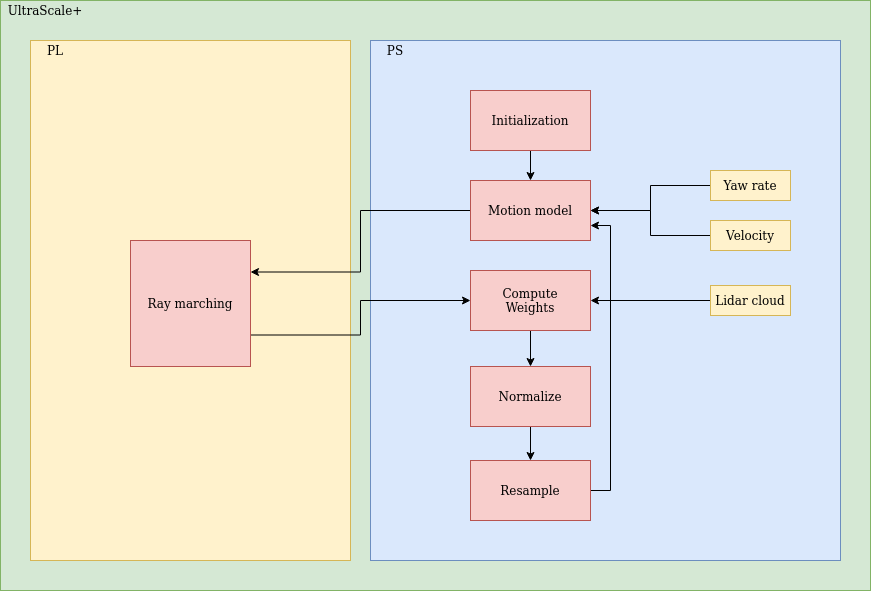

# Particle Filter Localization
Reference C++ implementation for all research on Particle Filtering applied to 2D-LiDAR localization.

This project is based on the [mit-racecar/particle_filter](https://github.com/mit-racecar/particle_filter) with a sensor model based on ray casting.

Currently, this implementation supports the following additional acceleration techniques:
* OpenMP (CPU multithreading)
* FPGA hardware acceleration (*coming soon!*)
* GPU acceleration (*coming soon!*)

## Workflow


#### Pre Process map
The particle filter node waits for the arrival of a map to preprocess and initialize the sensor model table.

#### Initial Pose
When an initial pose of the vehicle is received, the node proceeds to generate a first set of particles. These particles are distributed according to a normal distribution around the initial pose.

#### Laser Scan
Once a LiDAR scan is recieved, it is firstly downsampled and filtered for invalid rays, then we proceed with the localization update.

### Localization Update

#### Motion Model
The first step to update the localization is to apply the motion model. Specifically, odometry measurements (velocity and yaw rate) + noise are added to all particles.

#### Sensor Model
With the obtained particles and the downsampled laser scan we then perform the sensor modeling for each particle. This is implemented via the ray marching technique. After modeling the sensor of each particle, the particles are weighed.

#### Update Pose
The estimated pose output is then calculated via a weighted average of each particle.

After the pose estimation is complete, the node publishes:
* a nav_msgs/Odometry message containing the estimated pose
* a subset of the particle set
* a TransformStamped containing the transformation from lidar_link to map using the estimated pose

#### Resampling Particles
At the end of each loop we perform a low variance resampling on the particles.

This method resamples the particle set, with the probability of picking a particle proportional to its weight.

## Dependencies
* [ros_compatibility](https://github.com/HiPeRT/roscomp/)
* [adx_data](https://github.com/HiPeRT/adx_data/)
* [OpenCV](https://opencv.org/)

## Usage
You can compile this project in any ros2 workspace with

```
colcon build
```

To launch the project you can use any of the launchfiles in the `launch` folder with:

```
ros2 launch particle_filter <launchfile>.launch.xml
```

You can find all configurable parameters in the `conf` folder.

An initial guess of the pose can be sent by publishing to the `/initialpose` either manually or via the RViz GUI.

## Citations
This project accompanies the following publications. Please, cite/acknowledge if use this code for your research or projects.

### **An FPGA Overlay for Efficient Real-Time Localization in 1/10th Scale Autonomous Vehicles**

[Paper](docs/bernardi_DATE22-tshot.pdf) - [Presentation](https://www.youtube.com/watch?v=rduWzMLe3R8)

```
@inproceedings{9774517,
  author={Bernardi, Andrea and Brilli, Gianluca and Capotondi, Alessandro and Marongiu, Andrea and Burgio, Paolo},
  booktitle={2022 Design, Automation & Test in Europe Conference & Exhibition (DATE)},
  title={An FPGA Overlay for Efficient Real-Time Localization in 1/10th Scale Autonomous Vehicles},
  year={2022},
  volume={},
  number={},
  pages={915-920},
  doi={10.23919/DATE54114.2022.9774517}}
```

## Authors
* **Andrea Bernardi** - [abernardi](https://www.linkedin.com/in/andrea-bernardi-737b91200/)
* **Federico Gavioli** - [fgavioli](https://github.com/fgavioli)
* **Michele Guzzinati** - [mguzzinati](https://github.com/mguzzina)
* **Antonio Russo** - [russoanto](https://github.com/russoanto)

## PM
* **Alessandro Capotondi** - [acapotondi](https://github.com/alessandrocapotondi)
* **Paolo Burgio** - [pburgio](https://github.com/pburgio)

## License
**Apache 2.0** - [License](https://opensource.org/licenses/Apache-2.0)

## AD Project
This project is part of the autonomous driving project of the university of Modena and Reggio Emilia.