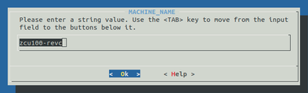
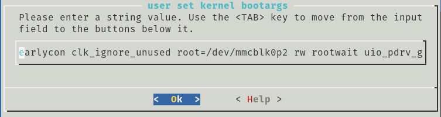
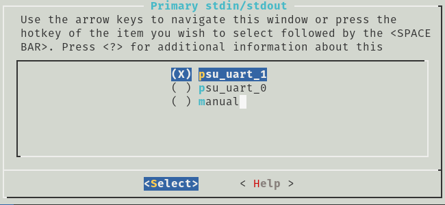
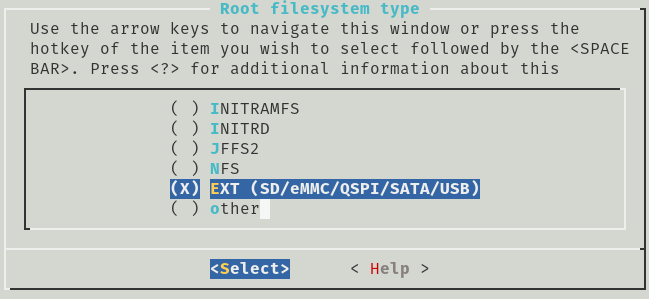
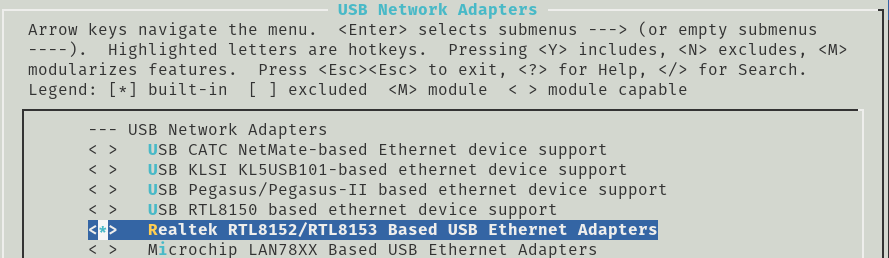
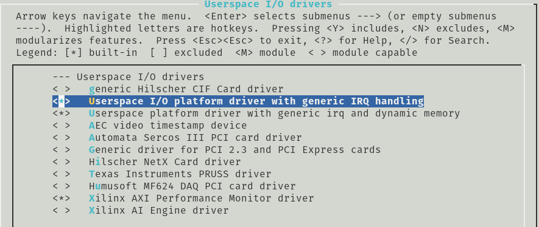
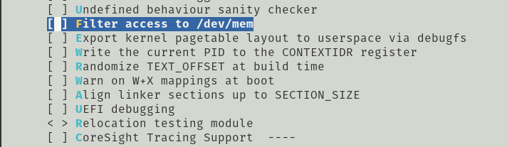
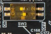
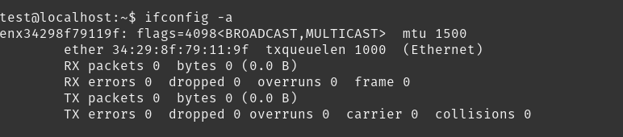
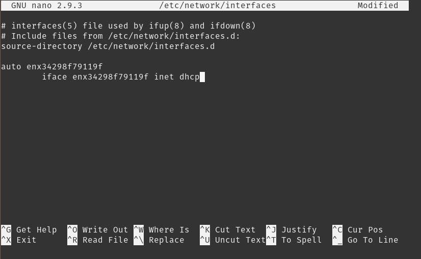

# Create Linux image with IP UIO Driver for Ultra96-v2

## Section 1: Preparing SDCard

 1- Insert the sdcard in the host computer USB port. (Ubuntu 18.04 OS is assumed as the host)

 2- Run GParted program to perform the sdcard partitioning. Select the sdcard (e.g., /dev/sdc)

 3- Create a new partion with 
```bash
size=2048MB 
filesystem:fat32
Label: BOOT
Create as: Primary Partition
```
 4- Assign the rest of the space on the sdcard to a new parttion with
```bash
size = <the rest of spapce>
filesystem:ext4
Label: rootfs
Create as: Primary Partition
```
 5- Apply all operations and then the sdcard with two partitions is ready.

## Section 2: Petalinux Project

 1- Create a petalinux project
```bash
petalinux-create -t project --template zynqMP -n <name-of-project>
```
2- Got to the project folder
```bash
cd <name-of-project>
```
3- Configure the project and imoprt <name_of_file>.xsa design file generated by Vivado
```bash
petalinux-config --get-hw-description=path/to/<name_of_file>.xsa
```
4- In the ```DTG Settings –>MACHINE NAME``` change template to ```zcu100-revc```




5- In the ```DTG Settings –>Kernel Bootargs``` disable ```generate boot args automatically``` option, then in the ```user set kernel bootargs``` enter the following arguments
```bash
earlycon clk_ignore_unused root=/dev/mmcblk0p2 rw rootwait uio_pdrv_genirq.of_id=generic-uio cma=256M
```


6- In the ```misc/config System Configuration``` window, go to ```Subsystem AUTO Hardware Settings–>Serial Setting``` and change the ```psu_uart_0``` to ```psu_uart_1``` and back to the main menu.



7- In the `misc/config System Configuration` window, go to `Image Packaging Configuration–>Root filesystem type` and change the `INITRAMFS` to `EXT (SD/eMMC/QSPI/SATA/USB)`.



8- Save and exit 

9- Configure the kernel by
```bash
petalinux-config -c kernel
```

10- In `Device Drivers–>Generic Driver Options–>Size in Mega Byte` change 256 to 1024

11- To activate the USB network interface select the `Realtek RTL8152/RTL8153 Based USB Ethernet Adapter` in `Device Drivers–>Network device support–>USB Network Adapter`



12- Enable the possibility to manage UIO drivers in `Device Drivers --> Userspace I/O drivers` ad include:
- <*> Userspace I/O platform driver with generic IRQ handling
- <*> Userspace platform driver with generic irq and dynamic memory


 
13- Petalinux 2019.2 by default does not allow the acess to  /dev/mem, to enable it go to `Kernel hacking` and disable the `Filter access to /dev/mem`



14- Save and exit 

15- Build the project by runnig
```bash
petalinux-build
```


16- if you want to reserve a suitable memory address space for data exchange between PL and PS in `<project>/project-spec/meta-user/recipes-bsp/device-tree/files/system-user.dtsi` add  the following lines
```bash
chosen {
		bootargs = "earlycon clk_ignore_unused root=/dev/mmcblk0p2 rw rootwait 
		uio_pdrv_genirq.of_id=generic-uio cma=256M";
		stdout-path = "serial0:115200n8";
	};
	reserved-memory {
		#address-cells = <2>;
		#size-cells = <2>;
		ranges;
	 
		reserved: buffer@0 {
			compatible = "shared-dma-pool";
			no-map;
			reg = <0x0 <start-address-in-hex> 0x0 <size-in-hex> >;
			linux,cma-default;
		};
	};
```
17- Copy the contents of  `<project_dir>/components/plnx_workspace/device-tree/device-tree/pl.dts` into `<project_dir>/project-spec/meta-user/recipes-bsp/device-tree/files/system-user.dtsi` 

18- If ypu want create a UIO driver of yur IP core in `<project_dir>/project-spec/meta-user/recipes-bsp/device-tree/files/system-user.dtsi` change the `compatible` name of your ip device-tree node in `generic-uio`.

For example:
```bash
amba_pl: amba_pl@0 {
		#address-cells = <2>;
		#size-cells = <2>;
		compatible = "simple-bus";
		ranges ;
		rayMarching_0: rayMarching@a0000000 {
			clock-names = "ap_clk";
			clocks = <&zynqmp_clk 71>;
			compatible = "generic-uio";
			interrupt-names = "interrupt";
			interrupt-parent = <&gic>;
			interrupts = <0 89 4>;
			reg = <0x0 0xa0000000 0x0 0x10000>;
			xlnx,s-axi-control-addr-width = <0x7>;
			xlnx,s-axi-control-data-width = <0x20>;
		};
	};
```

At the end  you should have system-user.dtsi file like this:
```bash
/include/ "system-conf.dtsi"
/ {

	chosen {
		bootargs = "earlycon clk_ignore_unused root=/dev/mmcblk0p2 rw rootwait 				
		uio_pdrv_genirq.of_id=generic-uio cma=256M";
		stdout-path = "serial0:115200n8";
	};
	reserved-memory {
		#address-cells = <2>;
		#size-cells = <2>;
		ranges;
	 
		reserved: buffer@0 {
			compatible = "shared-dma-pool";
			no-map;
			reg = <0x0 0x10000000 0x0 0x1000000>;
			linux,cma-default;
		};
	};


	amba_pl: amba_pl@0 {
		#address-cells = <2>;
		#size-cells = <2>;
		compatible = "simple-bus";
		ranges ;
		rayMarching_0: rayMarching@a0000000 {
			clock-names = "ap_clk";
			clocks = <&zynqmp_clk 71>;
			compatible = "generic-uio";
			interrupt-names = "interrupt";
			interrupt-parent = <&gic>;
			interrupts = <0 89 4>;
			reg = <0x0 0xa0000000 0x0 0x10000>;
			xlnx,s-axi-control-addr-width = <0x7>;
			xlnx,s-axi-control-data-width = <0x20>;
		};
	};
};
```

19- Build the project by runnig
```bash
petalinux-build
```
20- Genrate the BOOT file
```bash
petalinux-package --boot  --format BIN --fsbl images/linux/zynqmp_fsbl.elf --u-boot images/linux/u-boot.elf --pmufw images/linux/pmufw.elf --fpga images/linux/*.bit 
```
21- Copy BOOT.BIN and image.ub into the BOOT sdcard partition 
```bash
cp images/linux/BOOT.BIN images/linux/image.ub /media/<username>/BOOT
```
22- Extract Linux kernel modules from generated rootfs.tar.gz to be used later.

```bash 
cd images/linux
mkdir tmp
cp rootfs.tar.gz tmp/
cd tmp
tar -zxvf rootfs.tar.gz
```
## Section 3: Ubuntu rootfs

1- Install qemu tool
```bash
sudo apt-get install qemu-user-static
```
2- Download the Ubuntu rootfs for Arm64
```bash
wget http://cdimage.ubuntu.com/ubuntu-base/releases/18.04/release/ubuntu-base-18.04.3-base-arm64.tar.gz
```
3-Copy the Ubuntu rootfs in to the second partition in the sdcard 
```bash
sudo tar xfvp  ./ubuntu-base-18.04.3-base-arm64.tar.gz -C /media/<username>/rootfs/

sync
```
4- Copy these config files into the rootfs sdcard partition
```bash
sudo cp -av /usr/bin/qemu-aarch64-static /media/<username>/rootfs/usr/bin/

sudo cp -av /run/systemd/resolve/stub-resolv.conf /media/<username>/rootfs/etc/resolv.conf
```
5- Create these mount points
```bash
sudo mount --bind /dev/ /media/<username>/rootfs/dev
sudo mount --bind /proc/ /media/<username>/rootfs/proc
sudo mount --bind /sys/ /media/<username>/rootfs/sys
```
6- Boot the sdcard rootfs using the qemu 

```bash
sudo chroot  /media/<username>/rootfs/
```
7- add a new user and create a password
```
useradd -G sudo -m -s /bin/bash <username>
echo <username>:<password> | chpasswd
```
8- Install a few software on the sdcard rootfs
```bash
apt-get update
apt-get upgrade
apt-get -y install locales dialog perl sudo ifupdown net-tools ethtool udev wireless-tools iputils-ping resolvconf wget apt-utils wpasupplicant nano kmod openssh-client openssh-server build-essential cmake git
```
9- Quit the quem by running
```bash
exit
```
10- Perfrom these umount commads
```bash
sudo umount  /media/<username>/rootfs/dev
sudo umount  /media/<username>/rootfs/proc
sudo umount  /media/<username>/rootfs/sys
```

11- Copy Linux kernel modules generated in the previous part into sdcard. Go to the petalinux project forlder
```bash
cd images/linux/tmp
sudo cp -R lib/modules/4.19.0-xilinx-v2019.2/ /media/<user-name>/rootfs/lib/modules/
```
## Section 4: Boot Ubuntu 18.04 

1- Connect the board to the netwrok using a USB network adapter
2- To boot the Ultra96v2 board using the sdcard the position of the switch must be as show in the following image 

 

3- Run a serial terminal such as screen or putty
```bash
screen /dev/ttyUSB1 115200
```
4- login using generated user and password. Then run the following command to find the USB network adapter properties. In this case the name is `enx34298f79119f`
```bah
ifconfig -a
```


5- Open the `/etc/network/interfaces` file for editing and add these lines
```bash
auto <name-of-network-adapter>
 iface  <name-of-network-adapter> inet dhcp
```
in this case 



7- Run this command to enable the USB network. Then you should be able to connect to the Internet.

```bash
sudo ifup <name-of-network-adapter>
```
